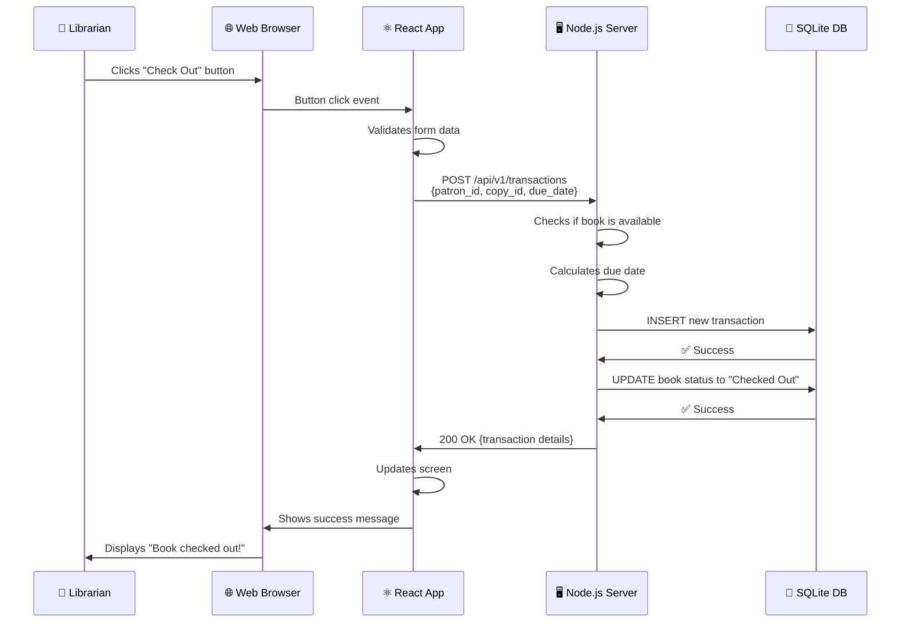
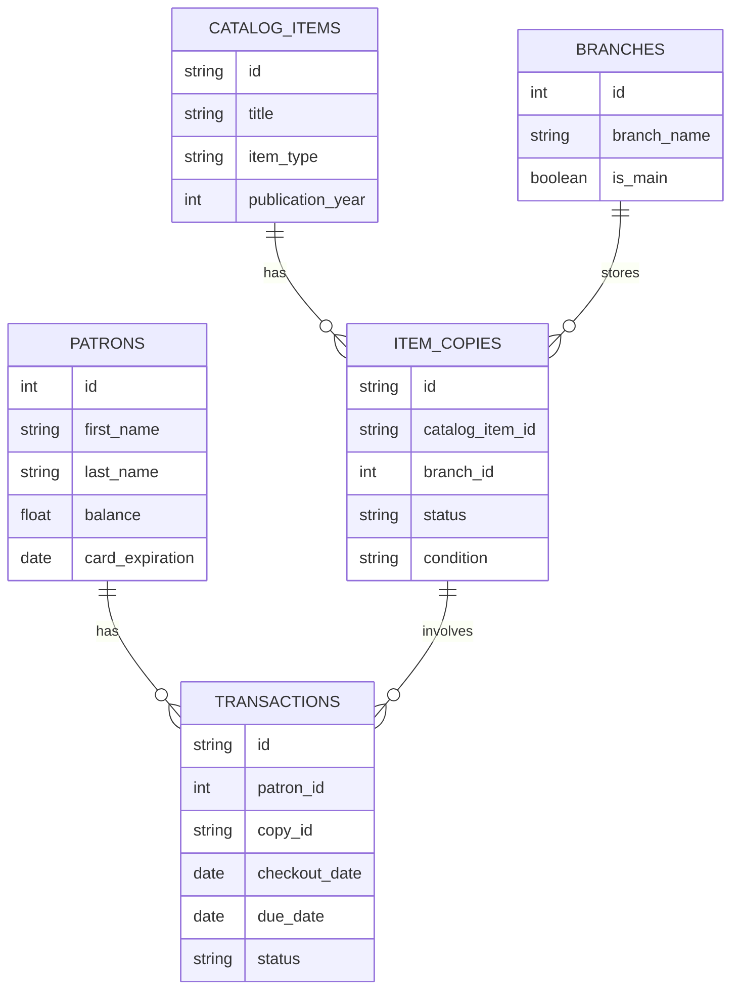

# 📚 Wayback Public Library - System Architecture

<br />

## 🎯 How It Works

### 1. **The UI** 🖥️

- **Web Browser**: This is where you view and use the library system
- **React Application**: The visual interface with buttons, forms, and tables
- **Examples**:
  - Check out a book button
  - Search for patrons
  - View transaction history

### 2. **The Communication** 📡

- **HTTP Requests**: When you click a button, the frontend sends a message to the backend
- **Think of it like**: Ordering food at a restaurant - you tell the waiter what you want
- **Examples**:
  - "GET /api/v1/books" → "Show me all books"
  - "POST /api/v1/transactions" → "Check out this book"

### 3. **The Backend (Behind the Scenes)** ⚡

- **Node.js Server**: The "brain" that processes requests and enforces rules
- **Examples**:
  - Makes sure a patron doesn't check out too many books
  - Calculates due dates
  - Checks if a book is available

### 4. **The Database (Memory)** 💾

- **SQLite Database**: Where all information is permanently stored
- **Stores**:
  - Books and media items
  - Patron information
  - Transaction history
  - Branch locations

---

### 🏗️ Project Architecture


## 🔄 Example: Checking Out a Book

---



### Step-by-Step:

1. **👵 Librarian**: Fills out form and clicks "Check Out"
2. **Form Validation**: React checks that all required fields are filled
3. **Send Request**: Frontend sends book and patron info to backend
4. **Business Logic**: Backend checks rules (is book available? is patron allowed?)
5. **Save Data**: Backend saves transaction and updates book status
6. **Return Result**: Backend tells frontend if it worked
7. **Update Screen**: Frontend shows success message and refreshes data
8. **User Feedback**: Librarian sees confirmation

---

## 🛢️ Database Structure



### What Each Table Stores:

- **PATRONS**: Library members (Luke Skywalker, Leia Organa, etc.)
- **CATALOG_ITEMS**: Types of items (books, videos, magazines)
- **ITEM_COPIES**: Physical copies of items (multiple copies of same book)
- **TRANSACTIONS**: Who checked out what and when
- **BRANCHES**: Library locations (Coruscant, Tatooine, etc.)

---

## 🛠️ Tech Stack

### Frontend (UI)

- **React** - Builds the user interface
- **TypeScript** - Adds type safety to prevent bugs
- **Material-UI** - Provides beautiful, pre-made components
- **React Query** - Manages data fetching and caching

### Backend (Server Side / API)

- **Node.js** - JavaScript runtime for the server
- **Express** - Web framework for handling requests
- **SQLite** - Lightweight database for storing data

---

## 🚀 Quick Start Guide

### To Run App:

0. **Install Packages**

   ```bash
   npm install
   cd server
   npm install
   ```

1. **Start the Server**:

   ```bash
   cd server
   npm run dev
   ```

   - Runs on: `http://localhost:3001`

2. **Start the UI**:

   ```bash
   cd ..
   npm run dev
   ```

   - Runs on: `http://localhost:3000`

---

## 📊 Data Flow

```
   UI  (React)
        ↓
   Hooks (useBooks, useTransactions)
        ↓
   Services (dataService.ts)
        ↓
   HTTP Requests (fetch API)
        ↓
   Backend Routes (Express)
        ↓
   Database Queries (SQLite)
        ↓
   DATA STORAGE (library.db)
```

## 📝 Notes

- **Frontend**: The part you see and click
- **Backend**: The hidden part that does the work
- **Database**: Where information is saved forever
- **API**: How the frontend and backend communicate
- **Component**: A reusable piece of the interface (like LEGO blocks)
- **Hook**: A function that fetches or manages data
- **Route**: A URL path that the server responds to
